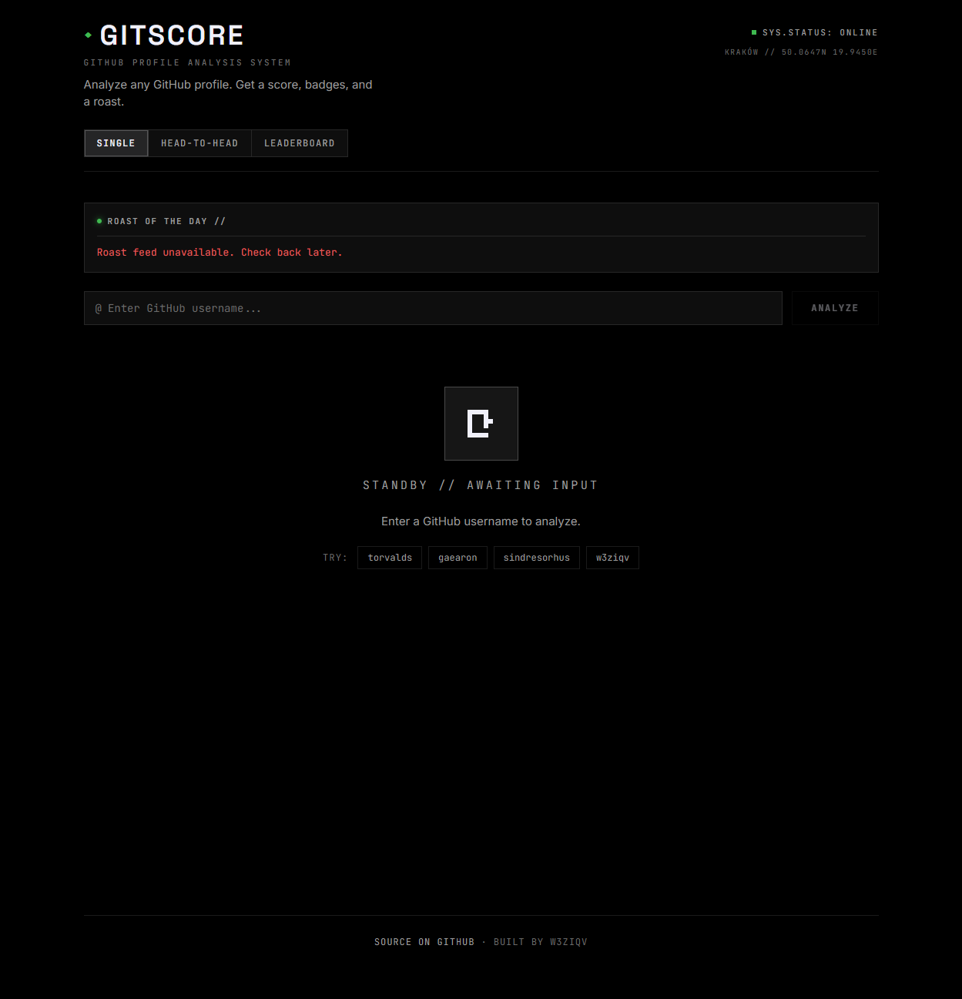

# GitScore

GitHub profile analyzer. Type a username, get a score from 0 to 1000, badges,
a language breakdown, and a roast. You can also compare two users head to head
or check the global leaderboard.

Live: [gitscore-mu.vercel.app](https://gitscore-mu.vercel.app)



## Features

- **Score (0–1000)** — five factors: repos, stars, followers, activity, language diversity. Weights and caps below.
- **Ranks** — F → D → C → B → A → S → S+, color-coded.
- **Badges** — 9 achievements (Polyglot, Rising Star, Social Butterfly, Open Sourcerer, ...) with progress bars for the locked ones.
- **Recommendations** — concrete tips with point impact, based on what's missing from your score.
- **Language breakdown** — what your repos are written in, as a stacked bar.
- **Recent activity** — last ~30 GitHub events.
- **Roast mode** — auto-generated critique of a profile, in EN/PL/ES/DE/FR. "Roast of the day" on the homepage.
- **Head-to-head** — two users side by side, winner highlighted.
- **Share card** — download a PNG with score, breakdown and badges.
- **Leaderboard** — global ranking persisted in Neon Postgres, with a localStorage fallback. Two extra tabs: *Most improved* (score delta over 7/30 days) and *Squad* (your pinned friends).
- **Embeddable badge** — `` for READMEs.

## Score algorithm

| Component | Max | How it's calculated |
|---|---|---|
| Repos | 200 | `min(round(31.62 * sqrt(repos)), 200)` — saturates around 40 repos |
| Stars | 300 | `min(round(48 * ln(1 + stars)), 300)` — logarithmic; 10 stars ≈ 115 pts, ~500 fills the cap |
| Followers | 200 | `min(round(29 * ln(1 + followers)), 200)` — logarithmic; ~1000 fills the cap |
| Activity | 150 | freshness tiers per repo: updated <7d = 20 pts, <30d = 10, <90d = 5 |
| Diversity | 150 | `min(languages * 20, 150)` |

Stars and followers are logarithmic on purpose: 100k stars should not be worth
10x what 10k is. Ranks: F <100, D 100+, C 200+, B 350+, A 500+, S 650+, S+ 800+.

## Tech stack

- Frontend: React 19 + TypeScript + Vite
- Backend: Vercel serverless functions (Node.js)
- Database: Neon Postgres (leaderboard, score history) with localStorage fallback
- Data: GitHub REST API
- Tests: Vitest — 71 unit tests (score, roast, localization, badge SVG, squad, score history)

## Run locally

```bash
npm install
npm run dev:all     # frontend on :5173 + local API on :3001
```

Tests and build:

```bash
npm test
npm run build
```

### Global leaderboard

The leaderboard needs `DATABASE_URL` (Neon Postgres). Create a free project
on [neon.tech](https://neon.tech), copy the pooled connection string into
`.env` (see `.env.example`) and set the same variable in Vercel. The schema
is created automatically on first request. Without `DATABASE_URL` everything
still works — the leaderboard just falls back to per-browser localStorage.

## API

| Method | Path | Description |
|---|---|---|
| GET | `/api/profile/:username` | Full analysis: score, badges, languages, repos |
| GET | `/api/roast/:username?lang=pl` | Roast (en/pl/es/de/fr, from `?lang` or `Accept-Language`) |
| GET | `/api/compare/:user1/:user2` | Side-by-side comparison |
| GET | `/api/activity/:username` | Recent GitHub events |
| GET | `/api/badge/:username` | 220×44 SVG score badge for README embeds |
| GET | `/api/score-history/:username?days=14` | Score timeline for the sparkline |
| GET | `/api/roast-of-the-day` | Today's roast from recently analyzed profiles |
| GET | `/api/leaderboard?tab=global\|improved&window=7\|30` | Global ranking or score-delta ranking |
| GET | `/api/health` | Health check |

## Badges

| Badge | Requirement |
|---|---|
| Newcomer | Account younger than 1 year |
| Veteran | Account older than 3 years |
| Polyglot | 5+ distinct languages |
| Rising Star | 10+ total stars |
| Social Butterfly | 50+ followers |
| Consistent | Pushed code in the last 7 days |
| Open Sourcerer | 20+ public repos |
| Zero to Hero | Score ≥ 500 |
| Need a Push | Score < 100 |

## Notes

- The UI is a dark mission-control look (SpaceX/x.ai inspired): black
  background, mono data readouts, hairline borders. No themes, one look.
- Badge glyphs in the UI are geometric characters (○ ◇ ☆ ▸), not emojis.
- Threshold webhooks (score-cross alerts) are opt-in: set `WEBHOOK_SUB_TOKEN`
  (a long random string) to enable `POST /api/webhook/threshold`.
- `screenshot.png` is regenerated from the homepage when the design changes.

## Author

Mateusz Szostak — [w3ziqv](https://github.com/w3ziqv)

## License

MIT
